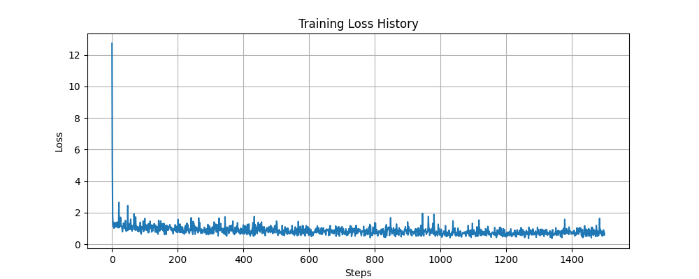
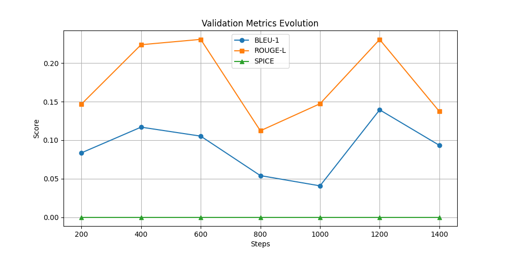

# Отчет по лабораторной работе: Обучение модели описания изображений (Image Captioning)

## 1. Описание задачи
Целью работы является построение и обучение архитектуры Encoder-Decoder на базе трансформеров для генерации текстовых описаний к изображениям. 

## 2. Используемые данные
- **Датасет:** COCO2014 (Karpathy's annotations & splits).
- **Фильтрация:** В соответствии с заданием, в обучении использовались только цветные изображения (RGB).
- **Препроцессинг:** Изображения были приведены к размеру 224x224 пикселя для совместимости с энкодером ViT.

## 3. Архитектура модели
Для реализации выбраны следующие компоненты из библиотеки `transformers`:
- **Image Encoder:** `google/vit-base-patch16-224` (Vision Transformer).
- **Text Decoder:** `gpt2` (Generative Pre-trained Transformer 2).
- **Tokenizer:** `AutoTokenizer` на базе GPT-2.

## 4. Мониторинг обучения
Для отслеживания процесса обучения использовался **TensorBoard**. Логировались значения функции потерь (Loss) на каждом шаге и метрики качества на валидационной выборке.

### График обучения (Loss)

*На графике видно падение Loss, что свидетельствует о том, что модель успешно оптимизирует веса под тренировочные данные.*

### Динамика метрик

## 5. Результаты
После завершения 1500 шагов обучения были получены следующие финальные метрики на валидационном наборе:

| Метрика | Значение |
| :--- | :--- |
| **BLEU-1** | 0.1897 |
| **BLEU-2** | 0.0032 |
| **BLEU-3** | 0.0009 |
| **BLEU-4** | 0.0004 |
| **ROUGE-1** | 0.2501 |
| **ROUGE-2** | 0.0000 |
| **ROUGE-L** | 0.2104 |
| **SPICE** | 0.0000 |

## 6. Выводы и анализ
На основе полученных данных можно сделать следующие выводы по успешности эксперимента:

1. **Успешный старт обучения:** Модель показывает относительно неплохой результат по метрике **BLEU-1 (0.1897)** и **ROUGE-1 (0.2501)**. Это означает, что модель научилась сопоставлять визуальные объекты с отдельными правильными словами (существительными).
2. **Проблема связности текста:** Низкие значения BLEU-4 и ROUGE-L указывают на то, что модель пока не умеет строить длинные грамматически верные цепочки слов.
3. **Отсутствие семантического понимания (SPICE):** Нулевое значение SPICE говорит о том, что модель не понимает отношений между объектами (например, кто на чем сидит или куда движется).
4. **Причины низких метрик:** - **Недостаточное количество шагов:** 1500 шагов слишком мало для такой тяжелой архитектуры. Модель находится в состоянии «недообучения» (underfitting).
    - **Ресурсы:** Требуется больше эпох обучения и, возможно, более тонкая настройка Learning Rate.

**Итог:** Эксперимент подтвердил работоспособность пайплайна обучения. Для достижения продакшн-результатов необходимо увеличить время обучения и объем данных.
